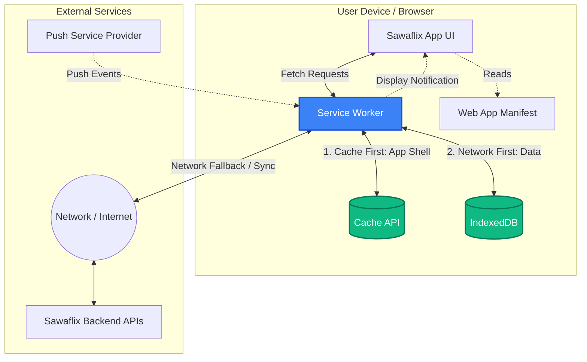

# Sawaflix App: Progressive Web App (PWA) Conversion Strategy

## 1. Executive Summary: Why Convert to a PWA?

As we look to enhance user engagement and provide a more seamless experience for Sawaflix users, converting our existing web application into a Progressive Web App (PWA) is a critical next step. A PWA bridges the gap between a traditional website and a native mobile application, offering several key advantages without the overhead of maintaining separate codebases for iOS and Android.

> [!IMPORTANT]
> **Key Business Drivers for PWA Adoption**
> - **Push Notifications:** Re-engage users proactively with updates, messages, or personalized content, significantly increasing daily active user (DAU) metrics.
> - **App-Like Experience & Installability:** Users can "install" Sawaflix directly to their home screen or desktop without going through an app store. It launches in a standalone, immersive window.
> - **Offline & Weak Network Resilience:** By caching core assets and data, Sawaflix will load instantly, even on poor connections, and provide meaningful offline functionality.
> - **Performance:** Enhanced caching mechanisms lead to lightning-fast load times, improving SEO and user retention.
> - **Cost Efficiency:** One unified codebase serves all platforms (web, desktop, Android, iOS).

---

## 2. Core Technical Concepts

To successfully implement a PWA, the team needs to integrate the following core web technologies:

### 2.1 The Web App Manifest
The Web App Manifest is a JSON file that tells the browser about the Sawaflix web application and how it should behave when installed on the user's mobile device or desktop. 
- It defines the app's name, icons, start URL, theme colors, and display mode (e.g., `standalone` to remove the browser UI).

### 2.2 Service Workers
A Service Worker is a JavaScript file that runs separately from the main browser thread. It acts as a network proxy, intercepting network requests made by Sawaflix.
- **Background Processing:** It enables features that don't require a web page or user interaction, such as push notifications and background data synchronization.
- **Lifecycle:** It has an independent lifecycle (Install -> Activate -> Fetch), meaning it can update caches in the background and immediately take over the network flow upon the next visit.

### 2.3 Caching Strategies
Using the Service Worker alongside the Cache API, we can programmatically determine how resources are served:
- **App Shell Architecture:** We will aggressively cache the minimal HTML, CSS, and JavaScript required to power the user interface (the "App Shell"). This ensures the UI loads instantly.
- **Dynamic Content:** We will utilize strategies like "Network First, falling back to cache" or "Stale-While-Revalidate" for API data (like video catalogs or user profiles) to balance data freshness with offline availability.

### 2.4 Secure Contexts (HTTPS)
PWAs require a secure context to operate. Service Workers have the power to hijack connections and fabricate responses, making HTTPS mandatory to prevent man-in-the-middle attacks.

---

## 3. System Architecture & Flow

The following diagram illustrates the high-level architecture of the Sawaflix PWA, highlighting the role of the Service Worker acting as a proxy between the app, the network, and the local cache.

### Architectural Flow Description:

1. **Initial Load & Registration:** When a user visits Sawaflix, the browser parses the HTML and registers the Service Worker (`sw.js`). Simultaneously, the browser reads the Web App Manifest to understand the app's metadata.
2. **Installation Phase:** The Service Worker triggers its `install` event. During this phase, it pre-caches the Sawaflix App Shell (core HTML, CSS, JS, logos).
3. **Network Interception (Fetch):** On subsequent navigations or API calls, the Service Worker intercepts all `fetch` events.
    - **For Static Assets:** It checks the Cache API first. If found, it returns the asset instantly without hitting the network.
    - **For Dynamic Data:** It attempts to hit the Sawaflix Backend API first. If successful, it returns the data and simultaneously saves a copy to IndexedDB. If the network is unavailable, it retrieves the last known data from IndexedDB, ensuring uninterrupted user experience.
4. **Push Notifications:** The Push Service Provider sends a payload to the browser. The browser wakes up the Service Worker (even if Sawaflix is closed), which then uses the Notifications API to display a message to the user.

---

## 4. Custom Install Prompt Experience

To maximize PWA installation adoption without relying entirely on the browser's native, sometimes unpredictable prompts, we will implement a custom "Install App" modal. 

> [!TIP]
> **Design Specification:**
> - **Trigger:** Displayed only after the user has engaged with the app for a specific duration (e.g., 30 seconds) or completed a core action (like watching a trailer), ensuring they have realized Sawaflix's value first.
> - **Placement:** A sleek, floating "toast" or modal emerging from the **bottom-left** corner of the screen.
> - **Content:** A brief, enticing message (e.g., *"Get the full Sawaflix experience! Install our app for offline access and instant notifications."*), accompanied by the recognizable Sawaflix logo.
> - **Actions:** Primary "Install Now" button and a secondary "Not Now" button.
> - **Technical Implementation:** We will intercept the browser's native `beforeinstallprompt` event, prevent it from showing automatically, and save the event reference. When the user clicks our custom "Install Now" button, we will fire the saved event to display the native installation confirmation.
> - **Logic:** If dismissed, a cookie/local storage flag is set to ensure it does not annoy the user for at least 14 days before prompting again.
